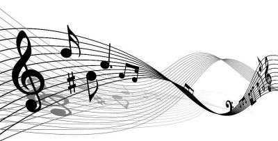
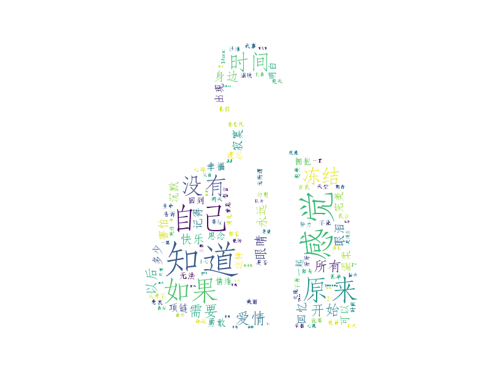

# AI_Generate_Chinese_Lyrics

Artificial intelligence has already been used to create a short film, snippets of angst-ridden poetry, and even the odd avant-garde melody. I have done some attempts about lyric generation with the power of AI.

## Requirements
Anaconda3 (Python3.5+)

# Usage
```bash
bash main.sh
```

## File Description
* 1-word_cloud_results: the word cloud picture of JJ Lin's (林俊杰 in Chinese) lyrics downloaded from [Netease Cloud Music](https://music.163.com).
* 2-keras_lstm_generation: lyrics generation using LSTM.

## Word Cloud Results

<div align=center></div>

## References
* [Download lyrics from QQ music](https://github.com/qwertyyb/lyricswordcloud)
* [Download lyrics from the NetEase's cloud music](https://github.com/2niuhe/lyrics_wordcloud)
* [CharRNN-LRC](https://github.com/jozhn/CharRNN-LRC)
* [keras_lstm_generation](https://github.com/shiwusong/keras_lstm_generation)


*More code will be uploaded soon!*
